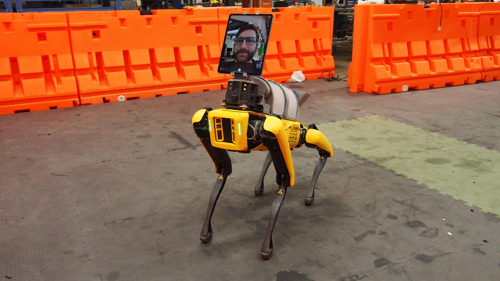

# A repo to share resources related to configurations for hospital applications.

Mobile robots can help keep healthcare workers safe during the COVID-19 pandemic by separating them from patients, minimizing the number of in-person interactions required during a course of treatment, and by reducing overall consumption of personal protective equipment.
Boston Dynamics has been working with healthcare organizations to model and test the use of mobile robots in the following applications:

1.  Telepresence and telemedicine
2.  Remote vital inspection
3.  Disinfecting hospital rooms
4.  Internal delivery

## Media

### Telepresence, telemedicine, and internal delivery

### Remote vital inspection
[Datasets](https://www.dropbox.com/sh/ockgn775u241559/AAB-7pQYOTCz_04fsR7YH-Tla?dl=0)

## Resources

*  Whitepaper: [*Healthcare Applications of Mobile Robotics during the COVID-19 Pandemic Response*](Applications%20of%20Mobile%20Robotics%20during%20COVID-19.pdf)
*  [Source, dependencies, and supported hardware](vitals_collection/drspot)
*  [ROS drivers for Optris thermal imagers](vitals_collection/optris_drivers)
    *  Forked from: [https://github.com/evocortex/optris_drivers](https://github.com/evocortex/optris_drivers)
*  [ROS drivers for FLIR A325sc thermal imagers](vitals_collection/maskor_gige_cam)
    *  Forked from: [https://github.com/MASKOR/maskor_gige_cam](https://github.com/MASKOR/maskor_gige_cam)
*  [ROS drivers for FLIR Blackfly / Chameleon with Spinnaker SDK](vitals_collection/spinnaker_sdk_camera_driver)
    *  Forked from: [https://github.com/neufieldrobotics/spinnaker_sdk_camera_driver](https://github.com/neufieldrobotics/spinnaker_sdk_camera_driver)
*  [image_view2 utility for manually specifying ROIs for measurements](vitals_collection/image_view2)
    *  Forked from: [https://github.com/jsk-ros-pkg/jsk_common](https://github.com/jsk-ros-pkg/jsk_common)

## Third-party Documentation

*  [Generic Interface for Cameras (GenICam) - (PDF)](vitals_collection/maskor_gige_cam/documentation/GenICam%20Standard.pdf)
*  [FLIR IR camera for GenICam data transfer: GenICAm ICD FLIR IR Camera - (PDF)](vitals_collection/maskor_gige_cam/documentation/GenICam%20ICD%20FLIR%20IR%20Camera%20-%20PC.pdf)  
*  [GenICam ICD FLIR AX5 Camera - (PDF)](vitals_collection/maskor_gige_cam/documentation/ICD%20GenICam%20ICD%20FLIR%20Ax5%20Camera%20-%20PC%20(en-US).pdf)
