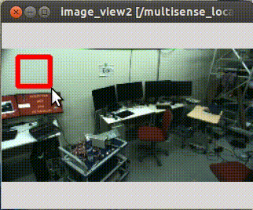
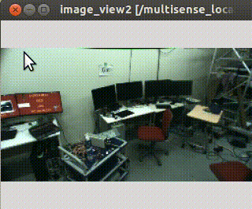
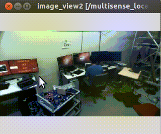
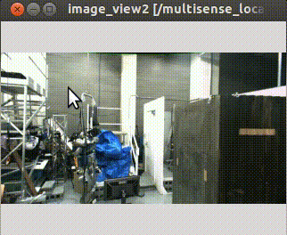
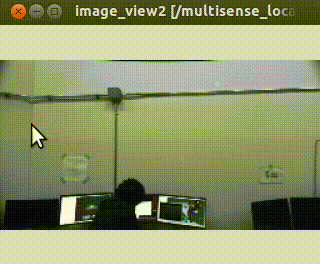
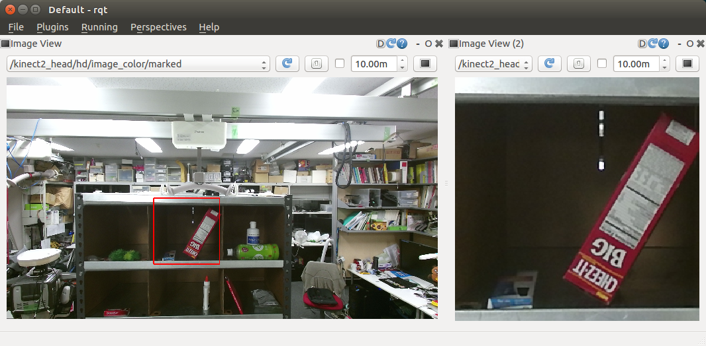

image_view2
==========


`image_view2` is an extended [image_view](http://ros.org/wiki/image_view).

Features
* Draw markers on image view
* Interact with user direction

Interaction Modes
-----------------
image_view2 support several mode to interact with user.
You can set interaction mode by `~interaction_mode` parameter or
change mode by service interfaces.

* Rectangle mode (`~interaction_mode:=rectangle`)

  In rectangle mode, user can select region-of-interest by dragging mouse pointer.

  

  Selected regions are published to
  `image/screenrectangle` (`geometry_msgs/PolygonStamped`) topic.

  If user clicks on the view instead of dragging pointer, clicked position
  is published to `image/screenpoint` (`geometry_msgs/PointStamped`) topic.

* Line mode (`~interaction_mode:=line`)

  In line mode, user can select a line by dragging mouse pointer.

  

  Selected line are published to `image/line` (`geometry_msgs/PolygonStamped`) topic.

* Polygon mode (`~interaction_mode:=poly`)

  In polygon mode, user can select a series of closed lines.
  User can add line by left-click and close the lines by right-click.

  

  Selected polygon are published to `image/poly` (`geometry_msgs/PolygonStamped`) topic.

* Grabcut mode (`~interaction_mode:=grabcut`)

  In grabcut mode, user can select two curves. By typing `Esc` key, you can clear
  selected curves.

  

  The selected first red curve  is published to
  `image/foreground` (`sensor_msgs/Image`) and
  the second green one is publiehd to `image/background` (`sensor_msgs/Image`).
  This mode is originally implemented to select forground and background pixels for grabcut.
* Grabcut Rectangle mode (`~interaction_mode:=grabcut_rect`)

  In grabcut rectangle mode, user can select two rectangles. By typing `Esc` key, you can clear
  selected rectangles.

  

  The selected first red rectangle  is published to
  `image/foreground_rect` (`geometry_msgs/PolygonStamped`) and
  the second green one is publiehd to
  `image/background_rect` (`geometry_msgs/PolygonStamped`).
  This mode is originally implemented to select forground and background regions for grabcut.

ROS API
-------

### Publising Topics

* `image/marked` (`sensor_msgs/Image`)

  Image with marks drawed.

* `image/screenrectangle_image` (`sensor_msgs/Image`)

  Cropped image with user selection at **Rectangle mode**.

  

### Subscribing Topics
* `image` (`sensor_msgs/Image`)

  Input image
* `camera_info` (`sensor_msgs/CameraInfo`)

  CameraInfo of the image. camera info is required to compute projection matrix
  when drawing markers.
* `image_marker` (`image_view2/ImageMarker2`)

  Marker topic.
* `image/event` (`image_view2/MouseEvent`)

  Event interface. image_view2 can handle mouse events without gui interaction.
  This topic is used to emulate event handling via ros topics

### Advertising Services
* `~change_mode` (`image_view2/ChangeMode`)

  Service interface to change interaction mode.
* `~rectangle_mode` (`std_srvs/Empty`)
* `~grabcut_mode` (`std_srvs/Empty`)
* `~grabcut_rect_mode` (`std_srvs/Empty`)
* `~line_mode` (`std_srvs/Empty`)
* `~poly_mode` (`std_srvs/Empty`)
* `~none_mode` (`std_srvs/Empty`)

  Service interface to change interaction mode with `std_srvs/Empty` service.

image_view2/ImageMarker2
-----------------------
image_view2/ImageMarker2 is a message to draw on image_view2 canvas.

Definition is:
```
byte CIRCLE=0
byte LINE_STRIP=1
byte LINE_LIST=2
byte POLYGON=3
byte POINTS=4
byte FRAMES=5
byte TEXT=6
byte LINE_STRIP3D=7
byte LINE_LIST3D=8
byte POLYGON3D=9
byte POINTS3D=10
byte TEXT3D=11
byte CIRCLE3D=12
byte ADD=0
byte REMOVE=1
std_msgs/Header header
  uint32 seq
  time stamp
  string frame_id
string ns
int32 id
int32 type
int32 action
geometry_msgs/Point position
  float64 x
  float64 y
  float64 z
geometry_msgs/PointStamped position3D
  std_msgs/Header header
    uint32 seq
    time stamp
    string frame_id
  geometry_msgs/Point point
    float64 x
    float64 y
    float64 z
geometry_msgs/PoseStamped pose
  std_msgs/Header header
    uint32 seq
    time stamp
    string frame_id
  geometry_msgs/Pose pose
    geometry_msgs/Point position
      float64 x
      float64 y
      float64 z
    geometry_msgs/Quaternion orientation
      float64 x
      float64 y
      float64 z
      float64 w
float32 scale
float32 width
std_msgs/ColorRGBA outline_color
  float32 r
  float32 g
  float32 b
  float32 a
byte filled
std_msgs/ColorRGBA fill_color
  float32 r
  float32 g
  float32 b
  float32 a
duration lifetime
byte arc
float32 angle
geometry_msgs/Point[] points
  float64 x
  float64 y
  float64 z
image_view2/PointArrayStamped points3D
  std_msgs/Header header
    uint32 seq
    time stamp
    string frame_id
  geometry_msgs/Point[] points
    float64 x
    float64 y
    float64 z
std_msgs/ColorRGBA[] outline_colors
  float32 r
  float32 g
  float32 b
  float32 a
string[] frames
string text
bool left_up_origin
bool ratio_scale
```
