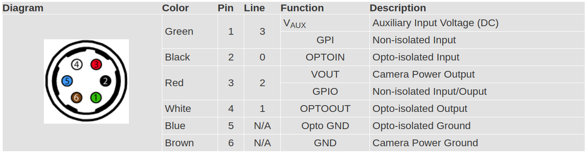
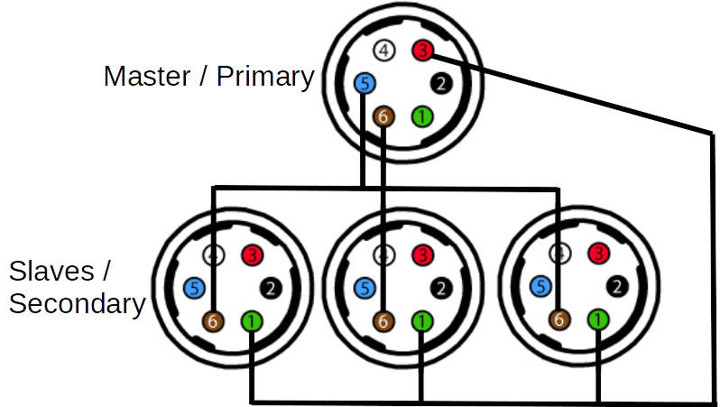

# spinnaker_sdk_camera_driver

These are the ros drivers for running the Pt Grey (FLIR) cameras that use the Spinnaker SDK.  This code has been tested with various Point Grey Blackfly S (BFS) cameras. 

## Getting Started

These instructions will get you a copy of the project up and running on your local machine for development and testing purposes.

### Prerequisites

The pre-requisites for this repo include:
* ros-kinetic-desktop-full
* spinnaker (download from [Pt Grey's website](https://www.ptgrey.com/support/downloads))
* ros-kinetic-cv-bridge
* ros-kinetic-image-transport

# Incase of x86_64 or x86_32 architecture, install the following:
* libunwind-dev

```bash
# after installing spinnaker verify that you can run your cameras with SpinView

# after installing ros, install other pre-requisites with: 

sudo apt install libunwind-dev ros-kinetic-cv-bridge ros-kinetic-image-transport

# if you use arm64 (aarch64), install pre-requisites with: 

sudo apt install ros-kinetic-cv-bridge ros-kinetic-image-transport

```

### Installing
To install the spinnaker drivers
```bash
mkdir -p ~/spinnaker_ws/src
cd spinnaker_ws/src
git clone https://github.com/neufieldrobotics/spinnaker_camera_driver.git
cd ~/spinnaker_ws/
catkin_make
source ~/spinnaker_ws/devel/setup.bash
# add this to ~/.bashrc to make this permanent 
```

## Running the drivers

Modify the `params/test_params.yaml` file replacing the cam-ids and master cam serial number to match your camera's serial number. Then run the code as:
```bash
# To launch nodelet verison of driver, use #

roslaunch spinnaker_camera_driver acquisition_nodelet.launch

# To launch node version of driver, use 

roslaunch spinnaker_camera_driver acquisition.launch
# Test that the images are being published by running
rqt_image_view
```
## Parmeters
All the parameters can be set via the launch file or via the yaml config_file.  It is good practice to specify all the 'task' specific parameters via launch file and all the 'system configuration' specific parameters via a config_file.  

### Task Specific Parameters
* ~binning (int, default: 1)  
  Binning for cameras, when changing from 2 to 1 cameras need to be unplugged and replugged
* ~color (bool, default: false)  
  Should color images be used (only works on models that support color images)
* ~exposure_time (int, default: 0, 0:auto)  
  Exposure setting for cameras, also available as dynamic reconfiguarble parameter.
* ~target_grey_value (double, default: 0 , 0:Continous/auto)
  Setting target_grey_value > 4 (min:4 , max:99) will turn AutoExposureTargetGreyValueAuto to 'off' and set AutoExposureTargetGreyValue to target_grey_value. Also available as dynamic reconfigurable parameter. see below in Dynamic reconfigurable parameter section.
* ~frames (int, default: 50)  
  Number of frames to save/view 0=ON
* ~live (bool, default: false)  
  Show images on screen GUI
* ~live_grid (bool, default: false)  
  Show images on screen GUI in a grid
* ~save (bool, default: false)  
  Flag whether images should be saved or not (via opencv mat objects to disk)
* ~save_path (string, default: "\~/projects/data")  
  Location to save the image data
* \~save_type (string, default: "bmp")  
  Type of file type to save to when saving images locally: binary, tiff, bmp, jpeg etc.
* ~soft_framerate (int, default: 20)  
  When hybrid software triggering is used, this controls the FPS, 0=as fast as possible
* ~time (bool, default=false)  
  Show time/FPS on output
* ~to_ros (bool, default: true)  
  Flag whether images should be published to ROS.  When manually selecting frames to send to rosbag, set this to False.  In that case, frames will only be sent when 'space bar' is pressed
* ~utstamps (bool, default:false)  
  Flag whether each image should have Unique timestamps vs the master cams time stamp for all
* ~max_rate_save (bool, default: false)  
  Flag for max rate mode which is when the master triggers the slaves and saves images at maximum rate possible.  This is the multithreaded mode

### System configuration parameters
* ~cam_ids (yaml sequence or array)  
  This is a list of camera serial numbers in the order which it would be organized.  The convention is to start from left to right.
* ~cam_aliases (yaml squence or array)  
This is the names that would be given to the cameras for filenames and rostopics in the order specified above eg. cam0, cam1 etc.
* ~master_cam (int, default: )  
  This is the serial number of the camera to be used as master for triggering the other cameras.
* ~skip (int)  
  Number of frames to be skipped initially to flush the buffer
* ~delay (float)  
  Secs to wait in the deinit/init sequence.


### Dynamic Reconfigure parameters
* ~target_grey_value (double)
  Target Grey Value is a parameter that helps to compensate for various lighting conditions by adjusting brightness to achieve optimal imaging results. The value is linear and is a percentage of the maximum pixel value.
  Explained in detail at [FLIR webpage](https://www.flir.com/support-center/iis/machine-vision/application-note/using-auto-exposure-in-blackfly-s/).

  Setting target_grey_value invokes setting AutoExposureTargetGreyValueAuto to 'off' and AutoExposureTargetGreyValue is set to target_grey_value.
* ~exposure_time (int, default= 0, 0:auto)
  Exposure time for the sensor.
  When Exposure time is set within minimum and maximum exposure time limits(varies with camera model), ExposureAuto is set to 'off' and ExposureTime is set to exposure_time param value. 

  When exposure_time is set to 0(zero), the ExposureAuto is set to 'Continuous', enabling auto exposure.

### nodelet details
* ~nodelet_manager_name (string, default: vision_nodelet_manager)
  Specify the name of the nodelet_manager under which nodelet to be launched.
* ~start_nodelet_manager (bool, default: false)
  If set True, nodelet_manager of name $(arg nodelet_manager_name) will be launched.
  If set False(default), the acquisition/capture_nodelet waits for the nodelet_manager name $(arg nodelet_manager_name).

### Camera info message details
* ~image_width (int)
* ~image_height (int)
* ~distortion_model (string)  
  Distortion model for the camera calibration.  Typical is 'plumb_bob'
* ~distortion_coeffs (array of arrays)  
  Distortion coefficients of all the cameras in the array.  Must match the number of cam_ids provided.
* ~intrinsic_coeff (array of arrays)  
  Intrinsic coefficients of all the cameras in the array.  Must match the number of cam_ids provided.
  Specified as [fx  0 cx 0 fy cy 0  0  1]
* ~projection_coeffs (array of arrays)  
  Projection coefficients of all the cameras in the array.  Must match the number of cam_ids provided.
  For case of Monocular camera, if projection_coeffs is not set, intrinsic_coeff will be used to set, P[1:3,1:3]=K
* ~rectification_coeffs (array of arrays)  
  Rectification coefficients of all the cameras in the array.  Must match the number of cam_ids provided.


## Multicamera Master-Slave Setup
When using multiple cameras, we have found that the only way to keep images between different cameras synched is by using a master-slave setup using the GPIO connector. So this is the only way we support multicamera operation with this code. A general guide for multi camera setup is available at https://www.ptgrey.com/tan/11052, however note that we use a slightly different setup with our package.
Refer to the `params/multi-cam_example.yaml` for an example on how to setup the configuration. You must specify a master_cam which must be one of the cameras in the cam_ids list. This master camera is the camera that is either explicitly software triggered by the code or triggered internally via a counter at a given frame rate. All the other cameras are triggered externally when the master camera triggers. In order to make this work, the wiring must be such that the external signal from the master camera **Line2** is connected to **Line3** on all slave cameras. To connect cameras in this way:
* Connect the primary (master) camera's pin 3 (red wire, GPIO) to each secondary (slave) camera's pin 1 (green wire, GPI).
* Connect the primary (master) camera's pin 5 (blue wire, opto ground) and pin 6 (brown wire, ground) to each secondary (slave) camera's pin 6 (brown wire, ground).

**GPIO Pinouts for Blackfly S**  


**GPIO Connections for Master/Slave config**  
  

## License
This project is licensed under the MIT License - see the [LICENSE](LICENSE) file for details
